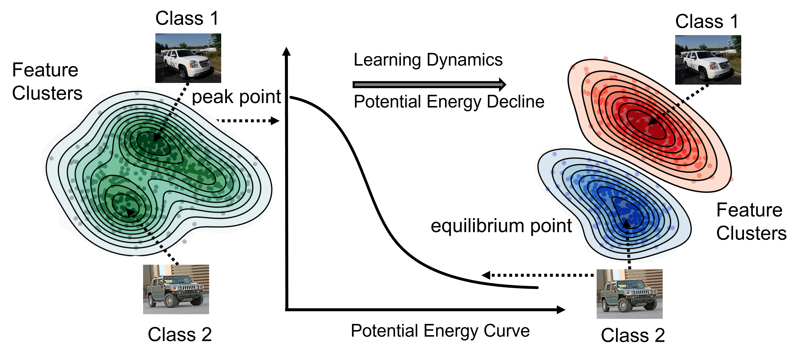

# Exploring Model Transferability through the Lens of Potential Energy
Official pytorch implementation of ["Exploring Model Transferability through the Lens of Potential Energy"](https://arxiv.org/abs/2308.15074) in International Conference on Computer Vision (ICCV) 2023.

By [Xiaotong Li](https://scholar.google.com/citations?user=cpCE_T4AAAAJ&hl=zh-CN), [Zixuan Hu](https://github.com/lixiaotong97/PED), [Yixiao Ge](https://geyixiao.com/), [Ying Shan](https://scholar.google.com/citations?user=4oXBp9UAAAAJ&hl=zh-CN), [Ling-Yu Duan](https://scholar.google.com/citations?user=hsXZOgIAAAAJ&hl=zh-CN).

## Introduction

> Transfer learning has become crucial in computer vision tasks due to the vast availability of pre-trained deep learning models. However, selecting the optimal pre-trained model from a diverse pool for a specific downstream task remains a challenge. Existing methods for measuring the transferability of pre-trained models rely on statistical correlations between encoded static features and task labels, but they overlook the impact of underlying representation dynamics during fine-tuning, leading to unreliable results, especially for self-supervised models. In this paper, we present an insightful physics-inspired approach named PED to address these challenges. We reframe the challenge of model selection through the lens of potential energy and directly model the interaction forces that influence fine-tuning dynamics. By capturing the motion of dynamic representations to decline the potential energy within a force-driven physical model, we can acquire an enhanced and more stable observation for estimating transferability. The experimental results on 10 downstream tasks and 12 self-supervised models demonstrate that our approach can seamlessly integrate into existing ranking techniques and enhance their performances, revealing its effectiveness for the model selection task and its potential for understanding the mechanism in transfer learning.




**Comparisons of weighted Kendall's tau** on 11 downstream classification datasets when selecting 11 pretrained self-supervised models.


| Method          | Reference    | Aircraft | Caltech101 | Cars  | Cifar10 | Cifar100 | Flowers | VOC  | Pets  | Food  | DTD   |
| --------------- | ------------ | -------- | ---------- | ----- | ------- | -------- | ------- | ---- | ----- | ----- | ----- |
| $\mathcal{N}$LEEP | CVPR'21 | -0.029   | 0.525      | 0.486 | -0.044  | 0.276    | 0.534   | -0.101 | 0.792 | 0.574 | 0.641 |
| PARC               | NIPS'21 | -0.03    | 0.196      | 0.424 | 0.147   | -0.136   | 0.622   | 0.618  | 0.496 | 0.359 | 0.447 |
| LogME            | ICML'21 | 0.223    | 0.051      | 0.375 | 0.295   | -0.008   | 0.604   | 0.158  | 0.684 | 0.570 | 0.627 |
| **LogME+Ours**                 | this paper | **0.509** | 0.505 | 0.516 | 0.511 | **0.667** | 0.715 | **0.620** | **0.795** | 0.650 | 0.780 |
| SFDA              | ECCV'22 | 0.254    | 0.523      | 0.515 | 0.619   | 0.548    | 0.773   | 0.568  | 0.586 | **0.685** | 0.749 |
| **SFDA+Ours**                  | this paper | 0.464 | **0.614** | **0.647** | **0.673** | 0.568 | **0.777** | 0.583 | 0.462 | 0.581 | **0.907** |
| GBC              | CVPR'22 | 0.048    | -0.18      | 0.424 | 0.008   | -0.249   | 0.532   | -0.041 | 0.655 | 0.268 | 0.05  |
| **GBC+Ours**                   | this paper | **0.462** | 0.285 | 0.547 | 0.017 | 0.359 | 0.768 | -0.035 | 0.684 | 0.402 | 0.576 |


## Getting Started
* Install [PyTorch](http://pytorch.org/)
* Clone the repo:
  ```
  git clone https://github.com/lixiaotong97/PED.git
  ```

### Requirements

- Install `PyTorch==1.7.1` and `torchvision==0.8.2` with `CUDA==10.1`:

```bash
conda install pytorch==1.7.1 torchvision==0.8.2 cudatoolkit=10.1 -c pytorch
```

- Install `timm==0.4.9`:

```bash
pip install timm==0.4.9
```

### Preparation
- Download the downstream datasets to `./data/*`.
- Follwing [ssl-tranfer](https://github.com/linusericsson/ssl-transfer) to download the pre-trained weights used, store at `./models/*`.

### Pipeline of Model selection using transferability
- Fine-tune pretrained models with hyper-parameters sweep to obtain ground-truth transferability score, which follows the implementation of SFDA.
```
python finetune.py -m byol -d cifar10
```
- Extract features of target data using pretrained models
```
python forward_feature.py -m byol -d cifar10
```
- Prepare the feature distribution on ImageNet (val) for rescaling.
```
python forward_feature.py -m byol -d imagenet
```
- Compute transferability scores using PED
```
python evaluate_metric_cpu.py -me PED -d cifar10
```
- Assess the effectiveness of PED
```
python tw.py -me PED -d cifar10
```

## Acknowledgement

This repository is built using the [SFDA](https://github.com/TencentARC/SFDA) and [ssl-transfer](https://github.com/linusericsson/ssl-transfer) repository. Thanks for their excellent projects!

## Reference
```
@InProceedings{Li_2023_ICCV,
    author    = {Li, Xiaotong and Hu, Zixuan and Ge, Yixiao and Shan, Ying and Duan, Ling-Yu},
    title     = {Exploring Model Transferability through the Lens of Potential Energy},
    booktitle = {Proceedings of the IEEE/CVF International Conference on Computer Vision (ICCV)},
    month     = {October},
    year      = {2023},
    pages     = {5429-5438}
}
```


